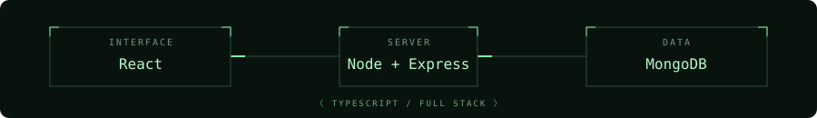
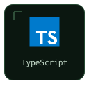
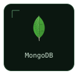
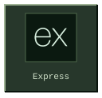
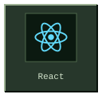
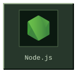
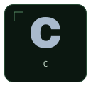
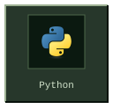
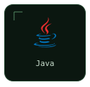

<p align="center">
  
</p>

<p align="center">
  <code>⌜ FULL STACK ENGINEERING ⌟</code>
</p>

<p align="center">
  
</p>

<p align="center">
  <a href="https://github.com/yeonatanRosental">github / yeonatanRosental</a>
</p>

## ⌜ 01 / Profile ⌟

I'm Yeonatan, a full stack developer working primarily with the MERN stack and TypeScript. I'm currently working on military development projects. Most of my work is confidential, so this profile offers a view of my skills rather than a project portfolio.

```yaml
name: Yeonatan Rosental
role: Full Stack Developer
primary_language: TypeScript
stack: [MongoDB, Express, React, Node.js]
other_languages: [C, Python, Java]
```

## ⌜ 02 / Stack ⌟

<p align="center">
  
</p>

<p align="center"><sub>PRIMARY STACK</sub></p>

<p align="center">
  
  
  
  
  
</p>

<p align="center"><sub>ADDITIONAL LANGUAGES</sub></p>

<p align="center">
  
  
  
</p>

## ⌜ 03 / GitHub Stats ⌟

Most of my projects are confidential. These statistics reflect the activity available to this profile's stats generator, including private repositories when access is configured.

<p align="center">
  
</p>

<p align="center">
  
</p>
