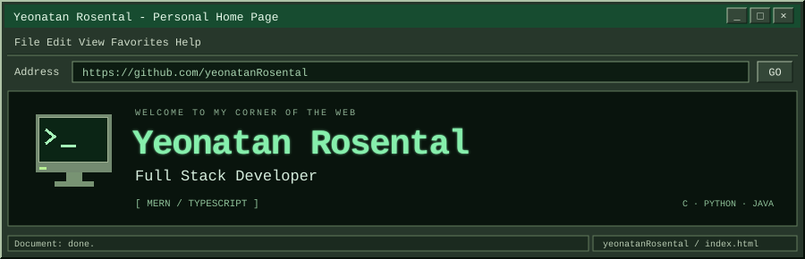
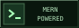
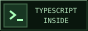
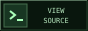
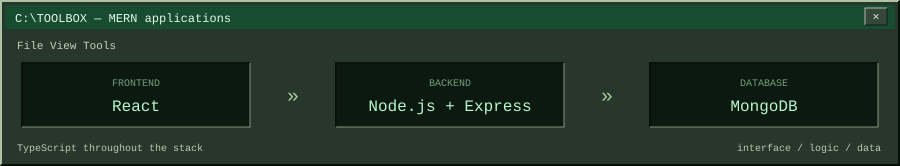
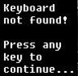
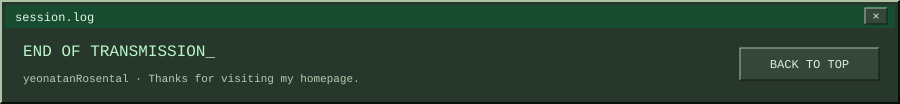

<a name="top"></a>

<p align="center">
  
</p>

<p align="center">
  <samp>+-- welcome to my corner of the web --+</samp>
</p>

<p align="center">
  <a href="#profile">[ profile.txt ]</a> · <a href="#stack">[ toolbox ]</a> · <a href="#stats">[ stats.log ]</a> · <a href="#playing">[ now playing ]</a> · <a href="#icons">[ icon shelf ]</a>
</p>

<table align="center">
  <tr><th><samp>~/yeonatan / index.html &nbsp; ─ □ ×</samp></th></tr>
  <tr><td align="center"></td></tr>
  <tr><td align="center"><samp>full stack developer / MERN / TypeScript</samp></td></tr>
</table>

<p align="center">
  
  
  <a href="https://github.com/yeonatanRosental/yeonatanRosental"></a>
</p>

<a name="profile"></a>

## `C:\PROFILE.TXT`

I'm Yeonatan, a full stack developer working primarily with the MERN stack and TypeScript. I'm currently working on military development projects. Most of my work is confidential, so this profile offers a view of my skills rather than a project portfolio.

```yaml
name: Yeonatan Rosental
role: Full Stack Developer
primary_language: TypeScript
stack: [MongoDB, Express, React, Node.js]
primary_tools: [Docker, OpenShift, Splunk]
other_languages: [C, Python, Java]
```

<a name="stack"></a>

## `C:\TOOLBOX`

<p align="center">
  
</p>

<p align="center"><sub>PRIMARY STACK</sub></p>

<p align="center">
  
  
  
  
  <br />
  
  
  
  
</p>

<p align="center"><sub>ADDITIONAL LANGUAGES</sub></p>

<p align="center">
  
  
  
</p>

<a name="stats"></a>

## `C:\STATS.LOG`

Most of my projects are confidential. These statistics reflect the activity available to this profile's stats generator, including private repositories when access is configured.

<p align="center">
  
</p>

<a name="playing"></a>

## Currently Playing Game

<p align="center"><samp>NOW PLAYING / ELDEN RING</samp></p>

<p align="center">
  <a href="https://www.gifservice.fr/en/gif/multi-media-video-games-e-elden-ring-icons-g17124-p372502-fsmall.gif">
    
  </a>
</p>

<a name="icons"></a>

## `C:\ICON_SHELF`

<p align="center"><samp>saved from the old web / 100 × 100 pixels of nostalgia</samp></p>

<p align="center">
  <a href="https://oldinterneticons.tumblr.com/post/657181594253180928"></a>
  <a href="https://oldinterneticons.tumblr.com/post/822866235095171072"></a>
  <a href="https://oldinterneticons.tumblr.com/post/187918140041"></a>
  <a href="https://oldinterneticons.tumblr.com/post/737273071676882944"></a>
</p>

<p align="center"><sub>Collected via <a href="https://oldinterneticons.tumblr.com/">Old Internet Icons</a> · <a href="assets/retro/SOURCES.md">image credits</a></sub></p>

<p align="center"><samp>[ thanks for stopping by ]</samp> · <a href="#profile">back to profile ↑</a></p>

<p align="center">
  <a href="#top"></a>
</p>
